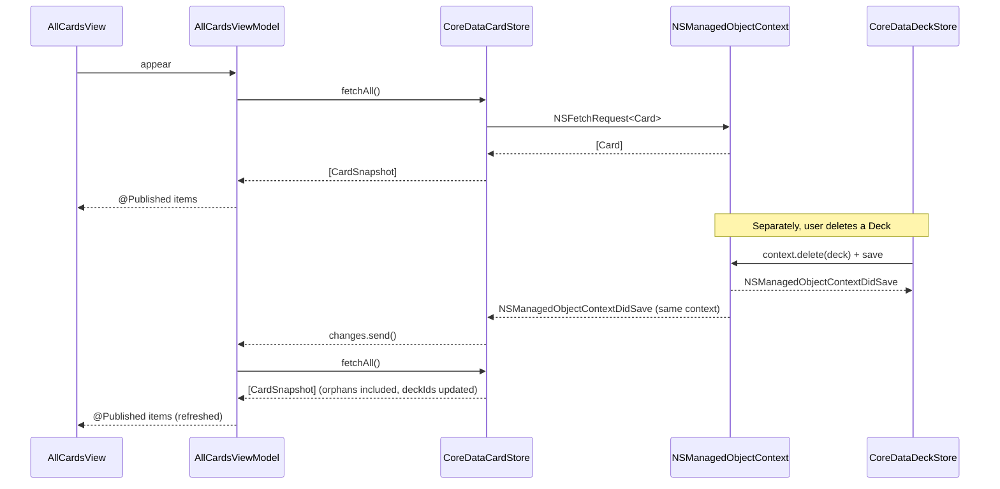

# Design Document — Card Management (P0)

## Overview

This design describes how HanaHou implements the P0 card management feature specified in `.kiro/specs/card-management/requirements.md`. It covers creating, viewing, editing, and deleting Cards inside a Deck; a per-Deck Card list; the All Cards view (which replaces the existing `AllCardsPlaceholderView` and surfaces every Card including orphans); and the supporting Core Data schema change and persistence plumbing.

Scope boundaries (per the requirements introduction):
- In scope: Card CRUD within a Deck, per-Deck `CardListView`, `AllCardsView` (replacing the placeholder), `CardEditorView`, and the persistence + domain infrastructure required to support them.
- Out of scope: study mode, Apple Pencil, spaced repetition, multi-Deck Card assignment from the UI, search, and filtering. The many-to-many schema (D003) is honored so P1+ can layer multi-Deck assignment without migration.

This design deliberately mirrors the deck-management design in structure and conventions so the two features compose cleanly. Where a pattern already exists for Decks, the Card-side analogue is named, justified, and kept minimal.

Referenced decisions: D003 (many-to-many Card-Deck), D007 (per-feature TDD), D011 (plain text only), D012 (delete-a-Deck detaches Cards; All Cards exposes orphans), D021 (example-based XCTest only), D024 (`updatedAt` auto-set on create, bumped on edit). Referenced docs: `docs/data-model.md`, `docs/p0.md`, `.kiro/specs/deck-management/design.md`, `.kiro/steering/tech.md`.

## Architecture

The feature extends the four-layer architecture established by deck-management. Dependencies remain one-way (top to bottom); value types (`CardDraft`, `CardSnapshot`) cross boundaries so the domain, view-model, and test layers never touch `NSManagedObject`.

```
┌──────────────────────────────────────────────────────────────┐
│  Views (SwiftUI)                                             │
│  DeckManagementRootView (extended)                           │
│  CardListView, AllCardsView, CardEditorView                  │
└──────────────────────────────┬───────────────────────────────┘
                               │ observes @Published state,
                               │ sends intents
                               ▼
┌──────────────────────────────────────────────────────────────┐
│  View Models (ObservableObject, @MainActor)                  │
│  CardListViewModel, AllCardsViewModel, CardEditorViewModel   │
└──────────────────────────────┬───────────────────────────────┘
                               │ calls
                               ▼
┌──────────────────────────────────────────────────────────────┐
│  Domain Services (pure Swift; no SwiftUI, no Core Data)      │
│  CardTextValidator, CardOrderingStrategy                     │
└──────────────────────────────┬───────────────────────────────┘
                               │ uses
                               ▼
┌──────────────────────────────────────────────────────────────┐
│  Persistence (CardStore protocol)                            │
│  CoreDataCardStore (prod), InMemoryCardStore (tests)         │
└──────────────────────────────────────────────────────────────┘
```

Key conventions carried over from deck-management:
- **The store protocol is the testability seam.** `CardStore` has two implementations: `CoreDataCardStore` for production and `InMemoryCardStore` for view-model and editor tests. This keeps unit tests simulator-free (Req 9 AC 1, 9 AC 3).
- **Value types cross boundaries.** `CardDraft` and `CardSnapshot` are the Card-side analogues of `DeckDraft` and `DeckSnapshot`. View models never see `NSManagedObject`.
- **The store is the only layer that talks to Core Data.** Views talk to view models; view models talk to the store protocol; the Core Data–backed store is an implementation detail of the composition root.
- **Change propagation is pull-based** via a `changes: AnyPublisher<Void, Never>` on `CardStore`. `CardListViewModel` and `AllCardsViewModel` subscribe and re-query on each signal. This matches `DeckStore` exactly (Req 7 AC 8).

### Composition and cross-store wiring

The composition root (`HanaHouApp.swift` + `Persistence.swift`) constructs both stores from the same `NSManagedObjectContext` and injects them where needed. Crucially, both stores observe `NSManagedObjectContextDidSave` on the shared context, so a deck deletion performed through `CoreDataDeckStore` emits a signal on `CoreDataCardStore.changes` as well. That is exactly how the All Cards view learns that a deck deletion turned some Cards into orphans (Req 6 AC 1, Req 6 AC 2).



This is the key design decision for Req 6 (orphaned card handling): we do not need any explicit "Deck was deleted" event type. Core Data's nullify rule on the `Card.decks` inverse relationship detaches affected Cards atomically with the Deck deletion; the shared-context save notification then drives every subscribed view model to re-query.

## Data Model

### Core Data schema — v3 migration

The current on-disk schema is v2 (`HanaHou 2.xcdatamodel`) with `Deck` and `Card` entities and the many-to-many relationship from D003 already in place. v2 also includes `Card.createdAt` but not `Card.updatedAt`. For D024 parity with Deck, we add a single attribute:

**Change in v3:** `Card.updatedAt: Date` — required, no default, populated by the store on create and bumped by the store on update.

**Migration baseline:** the project already ships a versioned `.xcdatamodeld` bundle (v1 `Item` → v2 `Deck+Card`), so v3 inherits that pattern directly:

1. Create `HanaHou 3.xcdatamodel` inside `HanaHou/HanaHou.xcdatamodeld/` by copying `HanaHou 2.xcdatamodel`.
2. Add the `updatedAt` attribute to `Card` in v3 only — leave v1 and v2 untouched.
3. Mark v3 as current in `.xccurrentversion`.
4. Lightweight migration is already enabled in `PersistenceController.init(inMemory:)`:
   ```swift
   description.shouldMigrateStoreAutomatically = true
   description.shouldInferMappingModelAutomatically = true
   ```
   No mapping model is required — adding a single required attribute with a reasonable default is a model case for inferred mapping.
5. **Backfill strategy for existing Cards.** Because the attribute is required, Core Data needs a value for every pre-existing row. We set `updatedAt`'s `Default Value` in the v3 model editor to a non-nil `Date` (inferred mapping supplies the migration-time value) and rely on lightweight migration to fill the column for any existing rows. Rationale: HanaHou is a personal app that has never shipped, so there are no real user Cards whose historical `updatedAt` we need to reconstruct. Paying for a post-migration fixup to set `updatedAt = createdAt` on pre-v3 rows would be complexity without payoff. If a future version of the app actually ships to users before this migration runs on their devices, we can revisit.

After migration the schema looks like this:

#### `Card` entity (v3)

| Attribute | Type | Optional | Default | Notes |
|-----------|------|----------|---------|-------|
| `id` | UUID | NO | — | Primary key; set in code on insert. |
| `frontText` | String | NO | `""` | Plain text only (D011). Stored as-entered. |
| `backText` | String | NO | `""` | Plain text only (D011). Stored as-entered. |
| `createdAt` | Date | NO | — | Set by the store on insert. |
| `updatedAt` | Date | NO | migration-time `Date()` | **New in v3.** Set equal to `createdAt` on insert; bumped on successful edit (Req 3 AC 5, Req 7 AC 6). Pre-v3 rows receive the migration-time default (see §Migration). |

**Relationships** (unchanged from v2):
- `decks` → `Deck` (to-many, **nullify** on delete of Deck). Inverse: `Deck.cards`.

The nullify rule on `Card.decks` is exactly what makes D012 work: deleting a Deck atomically drops the association from each related Card without touching the Card rows themselves. The card-management spec does not modify this rule — it inherits it — but it **does add tests** that assert the behavior at both the Core Data level and the view-model level (see Testing Strategy §B11-C).

**Constraints:**
- `id` remains the only Core Data uniqueness constraint. No uniqueness on text (Cards with identical front/back content are allowed).

**Indexing:** none in P0. Fetch volume is small; if the All Cards view ever becomes slow with large stores, a fetch index on `createdAt` is the first optimization.

### Value types (domain layer)

These mirror `DeckDraft` / `DeckSnapshot` one-for-one. They cross the persistence boundary so the domain and view-model layers never import Core Data.

```swift
struct CardDraft: Equatable {
    var frontText: String
    var backText: String
}

struct CardSnapshot: Equatable, Identifiable, Hashable {
    let id: UUID
    let frontText: String
    let backText: String
    let createdAt: Date
    let updatedAt: Date
    let deckIds: Set<UUID>   // many-to-many (D003); empty set == orphaned card
}
```

Notes:
- `deckIds: Set<UUID>` is the explicit many-to-many carrier. An empty set identifies an Orphaned_Card (the exact definition from the Glossary). This is what the All Cards view model uses to label or group orphans if desired.
- `CardSnapshot` is `Hashable` so it can ride inside `NavigationPath` routes (same rationale as `DeckSnapshot`).
- `CardDraft` intentionally does **not** include `deckIds`. Multi-Deck assignment is out of scope for this spec (per introduction). The Deck membership of a *new* Card is supplied directly to `CardStore.create(...)` as a separate argument so the P0 editor can pass exactly one `deckId` without forcing future expansion through a draft-level change.

### `CardTextError`

```swift
enum CardTextError: Error, Equatable {
    case missingFront
    case missingBack
}
```

Two distinct cases — not one combined case — so the editor can surface which side(s) are invalid inline under the correct field (Req 1 AC 3, 1 AC 4, 3 AC 3, 3 AC 4). Cases intentionally do not carry the offending text: the editor already has it.

## Domain Layer

### `CardTextValidator` (pure function)

Mirrors `DeckNameValidator` in shape — a pure static function with an explicit `Result` return — but the rules are smaller because there's no uniqueness or reserved list to enforce for Card text.

```swift
struct CardTextValidator {
    static func validate(draft: CardDraft) -> Result<CardDraft, CardTextError> {
        if trimmed(draft.frontText).isEmpty { return .failure(.missingFront) }
        if trimmed(draft.backText).isEmpty  { return .failure(.missingBack) }
        return .success(draft)
    }

    private static func trimmed(_ s: String) -> String {
        s.trimmingCharacters(in: .whitespacesAndNewlines)
    }
}
```

Rules (Req 1.3, 1.4, 3.3, 3.4, Glossary "Non-empty text"):
- `trimmed(frontText).isEmpty` → `.missingFront`.
- `trimmed(backText).isEmpty` → `.missingBack`.
- Front is checked before back so the editor surfaces a single, stable error per submit — but the editor re-validates both fields on each change so both can be displayed concurrently (see ViewModels §CardEditorViewModel).

Rationale for not folding validation into `CardStore.create`/`update`: the editor needs live feedback as the user types, so the validator must be callable from the view-model layer without mutating anything. `CoreDataCardStore.create/update` still re-runs the validator as defense-in-depth before save, matching the `DeckNameValidator` pattern.

### Ordering strategy — reuse a generic protocol or add `CardOrderingStrategy`?

The per-Deck Card list and the All Cards view both require `createdAt` ascending with `id` tiebreaker (Req 2 AC 3, Req 5 AC 4). Two options:

- **A. Generic `OrderingStrategy<Item>` protocol** that both `DeckOrderingStrategy` and a Card-side equivalent adopt. Maximum code reuse.
- **B. Introduce `CardOrderingStrategy` as a sibling protocol** of `DeckOrderingStrategy`, each with its own default `CreationDateAscending…` implementation.

**Decision: Option B — `CardOrderingStrategy` as a sibling.** Rationale:
- It matches the existing pattern exactly (`DeckOrderingStrategy` is already concrete, not generic). Symmetry with deck-management is more valuable than marginal DRY.
- A generic `OrderingStrategy<Item>` requires `Item: Identifiable & …` or free functions to obtain `createdAt`/`id`, which adds indirection that isn't paying for itself at P0 scale.
- D009 (swappable ordering) is stated *per concept* — deck ordering is one strategy, card ordering is another. Future card orderings (e.g., "most recently updated first" keyed on `updatedAt`) are a natural fit for a Card-specific protocol.

```swift
protocol CardOrderingStrategy {
    func order(_ cards: [CardSnapshot]) -> [CardSnapshot]
}

struct CardCreationDateAscendingOrdering: CardOrderingStrategy {
    init() {}
    func order(_ cards: [CardSnapshot]) -> [CardSnapshot] {
        cards.sorted { ($0.createdAt, $0.id.uuidString) < ($1.createdAt, $1.id.uuidString) }
    }
}
```

Both `CardListViewModel` and `AllCardsViewModel` depend on the protocol and accept any conforming strategy at init time. The composition root hands them a `CardCreationDateAscendingOrdering` in P0.

## Persistence Layer

### `CardStore` protocol

Mirrors `DeckStore` in every contract detail so both stores behave identically from the view-model layer's perspective.

```swift
protocol CardStore {
    /// All cards in the store, regardless of deck membership. Includes orphans.
    func fetchAll() throws -> [CardSnapshot]

    /// Cards associated with the given deck id. Order is unspecified; callers
    /// are expected to apply a `CardOrderingStrategy`.
    func fetchInDeck(deckId: UUID) throws -> [CardSnapshot]

    /// Create a new card with the given text and initial deck membership.
    /// `deckIds` may be empty (creating an orphan); the P0 editor supplies
    /// exactly one deck id when invoked from a per-deck list.
    func create(
        frontText: String,
        backText: String,
        deckIds: Set<UUID>
    ) throws -> CardSnapshot

    /// Replace the card's text content. Bumps `updatedAt` to the clock's
    /// current value (Req 3 AC 5, D024). Preserves id, createdAt, and deck
    /// associations (Req 3 AC 5). Update on an unknown id is a silent no-op
    /// that MUST NOT emit on `changes` (Req 7 AC 9).
    func update(id: UUID, frontText: String, backText: String) throws

    /// Remove the card. Delete on an unknown id is a silent no-op that MUST
    /// NOT emit on `changes` (Req 7 AC 9). Deleting a card detaches it from
    /// every deck (Req 4 AC 3) without deleting any deck (Req 4 AC 4).
    func delete(id: UUID) throws

    /// Emits once per successful mutation. Does not emit for validation
    /// failures or unknown-id no-ops.
    var changes: AnyPublisher<Void, Never> { get }
}

enum CardStoreError: Error {
    case persistenceFailed(underlying: Error)
}
```

Signature details worth calling out:
- **`create` takes an explicit `deckIds: Set<UUID>` argument** rather than folding deck membership into `CardDraft`. The P0 per-Deck editor passes a singleton set; a future multi-Deck editor can pass any set without changing the protocol. This matches Req 7 AC 5.
- **`update` does not return a snapshot**, unlike `DeckStore.update`. The rationale is that Card update has no user-surfaced validation beyond text (which was already checked) and no id-change risk, so the view model re-reads via `fetchInDeck` / `fetchAll` after the `changes` signal. This keeps the protocol smaller and keeps the "pull-based refresh" story consistent. (If a future spec needs the snapshot, returning `@discardableResult CardSnapshot` is an additive change.)
- **`update` and `delete` on unknown id are silent no-ops** (Req 7 AC 9). The equivalent deck-store rule is tested by `InMemoryDeckStoreTests.test_delete_nonExistentId_isSilentNoOp_andDoesNotEmit`; the card-store adds the same assertion for both `update` and `delete`.
- **`changes` is an `AnyPublisher<Void, Never>`** — no payload, just a nudge to re-query. Identical to `DeckStore` so a single subscription pattern works for both.

### Clock injection

Both implementations take a `clock: () -> Date` in their initializer, matching `DeckStore` (Req 9 AC 2). Tests use `makeMutableClock(initial:)` — the pattern already lives in `HanaHouTests/Persistence/InMemoryDeckStoreTests.swift` — so test time can advance deterministically between `create` and `update`.

### `CoreDataCardStore` (production)

Structure mirrors `CoreDataDeckStore`:

- Holds the injected `NSManagedObjectContext` and `clock`.
- Observes `NSManagedObjectContextDidSave` on that context and republishes via a `PassthroughSubject<Void, Never>`.
- Removes the observer in `deinit`.
- Every mutation is wrapped in the standard create/update/delete-then-save pattern; on save failure, the context is rolled back and `CardStoreError.persistenceFailed(underlying:)` is thrown.

The `fetchInDeck(deckId:)` implementation uses an `NSPredicate` on the many-to-many relationship:

```swift
let request = NSFetchRequest<NSManagedObject>(entityName: "Card")
request.predicate = NSPredicate(format: "ANY decks.id == %@", deckId as CVarArg)
```

This expresses "cards whose `decks` set contains an entry with the given id", which is the exact semantics Req 2 AC 1 requires. An explicit sort descriptor is **not** applied in the store; the ordering strategy is the view model's responsibility. Keeping ordering out of the store lets multiple view models with different orderings (e.g., a future "most recently updated" All Cards mode) share a single store without conflict.

`create` resolves `deckIds` into `NSManagedObject` references via a single `NSFetchRequest<NSManagedObject>` on `Deck` with `predicate: "id IN %@"`, then sets `card.setValue(Set(decks), forKey: "decks")`. Missing deck ids (a caller bug) are silently dropped from the resulting relationship — consistent with the "unknown id is a no-op" principle — rather than failing the creation.

### `InMemoryCardStore` (tests)

Mirrors `InMemoryDeckStore`. Backing state is a `[UUID: CardSnapshot]`; deck membership is carried inside each snapshot's `deckIds`. Mutations emit on the `changesSubject` only when they actually change state. Unknown-id `update`/`delete` are silent no-ops (Req 7 AC 9) — they return without throwing and do not send on `changes`.

Orphaning behavior needs one additional consideration: when a Deck is deleted, the `InMemoryCardStore` has no built-in signal that the deletion happened (it does not share state with `InMemoryDeckStore`). Because Req 6 AC 1 is a Core Data concern — the nullify rule on the Core Data schema is what enforces orphaning — the `InMemoryCardStore` does not simulate it automatically. Tests that care about orphaning behavior either:

- Drive the Core Data–backed stack (both `CoreDataDeckStore` and `CoreDataCardStore` sharing a context), where the nullify rule does the right thing; or
- Directly mutate the in-memory card's `deckIds` via a **test-only helper** `InMemoryCardStore.simulateDeckDeleted(deckId:)` that removes the deck id from every stored `CardSnapshot.deckIds` and emits one `changes` signal. This helper is surfaced as `internal`, documented as test-only, and kept out of the `CardStore` protocol.

This keeps the production protocol minimal (orphaning is a Core Data behavior) while still letting `AllCardsViewModelTests` exercise the "delete-a-deck turns cards into orphans" flow without a Core Data stack.

## ViewModels

### `CardEditorViewModel`

Unifies create and edit into a single mode enum, mirroring `DeckEditorViewModel`.

```swift
@MainActor
final class CardEditorViewModel: ObservableObject {
    enum Mode: Equatable {
        case create(deckId: UUID?)   // nil == creating in "All Cards" / orphan context
        case edit(CardSnapshot)
    }

    @Published var frontText: String
    @Published var backText: String
    @Published private(set) var frontError: CardTextError?
    @Published private(set) var backError:  CardTextError?

    let mode: Mode

    init(mode: Mode, store: CardStore, clock: @escaping () -> Date = Date.init)

    /// Validate both fields and update @Published error state.
    func validate()

    /// Submit. Throws CardTextError on validation failure (and sets the
    /// corresponding @Published). Throws whatever the store throws on
    /// persistence failure. Returns the persisted CardSnapshot on success.
    @discardableResult
    func submit() throws -> CardSnapshot

    /// Delete the card being edited. No-ops in .create mode.
    func delete() throws
}
```

Key points:
- **Two error channels, not one.** `frontError` and `backError` are independent `@Published` optionals so the editor can show one, the other, or both messages simultaneously. `validate()` applies the two non-empty rules independently to the two fields — there is no need to invoke the validator twice with swapped inputs. `CardTextValidator` remains the single source of truth for the rules; the view model just applies each rule to its corresponding field and publishes both errors.
- **`.create(deckId: UUID?)` takes an optional deck id.** The P0 per-Deck editor passes the current deck's id. A future "create from All Cards" surface can pass `nil` to create an orphan. Req 6 AC 3 / AC 4 say the editor must work for orphans — editing an orphan (Mode `.edit` where `snapshot.deckIds.isEmpty`) already works because edit mode doesn't touch deck membership. Creating an orphan is possible because `deckId` is optional.
- **`delete()` on the view model.** Placing delete on the editor (not the list) puts the "delete affordance" next to the edit flow where users expect it. The list view also wires a swipe-to-delete on its rows; both ultimately call `CardStore.delete(id:)`.
- **Submit is gated on validation.** Save is disabled in the view when `frontError != nil || backError != nil || trimmed(front/back).isEmpty`. The view model re-validates on every `@Published` change through a `.onChange` hook in the view; `submit()` re-validates one last time as defense.

### `CardListViewModel` (per-Deck)

Exposes a `[CardRowItem]` (see §"Row models" below). Subscribes to `CardStore.changes` and re-queries `fetchInDeck(deckId:)` on each signal, then applies the ordering strategy.

```swift
@MainActor
final class CardListViewModel: ObservableObject {
    @Published private(set) var items: [CardRowItem] = []
    let deckId: UUID
    private let store: CardStore
    private let strategy: CardOrderingStrategy
    private var cancellables: Set<AnyCancellable> = []

    init(deckId: UUID, store: CardStore, strategy: CardOrderingStrategy)

    func reload()

    /// Delegates to the store; surfaces errors to the caller.
    func delete(id: UUID) throws
}
```

- `items` is `@Published` of a row model (below), not `[CardSnapshot]`. The indirection exists so the view layer doesn't have to translate snapshots into display strings inline.
- `reload()` is explicit and called from `init` and on `changes`. Explicit reload is also useful for tests (same pattern as `DeckListViewModel.reload()`).
- The list's empty state (Req 2 AC 5) is decided by the view based on `items.isEmpty`, not by a separate view-model flag.

### `AllCardsViewModel`

Structurally the same as `CardListViewModel` but queries `fetchAll()` and surfaces every card — orphans included (Req 5 AC 2, Req 6 AC 2).

```swift
@MainActor
final class AllCardsViewModel: ObservableObject {
    @Published private(set) var items: [CardRowItem] = []
    private let store: CardStore
    private let strategy: CardOrderingStrategy
    private var cancellables: Set<AnyCancellable> = []

    init(store: CardStore, strategy: CardOrderingStrategy)

    func reload()
    func delete(id: UUID) throws
}
```

The two list view models are near-duplicates on purpose. The alternative — a single `CardListViewModel` with a `.allCards` vs `.deck(id)` scope enum — was considered and rejected: the two cases don't share enough behavior to justify the branching (the per-Deck view will eventually want a "new card in this deck" affordance wired to `Mode.create(deckId: deckId)`, and All Cards won't). Keeping them separate keeps each view model small and focused; small amounts of call-site similarity are a reasonable cost.

### Row models

A small helper type avoids scattering display logic across views:

```swift
struct CardRowItem: Identifiable, Equatable, Hashable {
    let id: UUID            // same as the underlying CardSnapshot.id
    let frontText: String
    let backText: String
    let isOrphan: Bool      // snapshot.deckIds.isEmpty
}
```

The view models map `CardSnapshot → CardRowItem` during reload. `isOrphan` lets the All Cards view optionally badge orphaned rows; P0 leaves the visual choice to the view.

## Views

### Navigation wiring

The existing `DeckManagementRootView` declares routes in a `DeckManagementRoute` enum. Card management extends that enum:

```swift
enum DeckManagementRoute: Hashable {
    case createDeck
    case editDeck(DeckSnapshot)
    case allCards                     // existing; destination changes
    case cardList(DeckSnapshot)       // new
    case createCard(deckId: UUID)     // new
    case editCard(CardSnapshot)       // new
}
```

The `.allCards` case already exists; its destination in `DeckManagementRootView`'s `navigationDestination(for:)` is the only thing that changes: it now resolves to `AllCardsView` instead of `AllCardsPlaceholderView` (Req 5 AC 7, Req 8 AC 1). `DeckListView.onNavigate(.allCards)` and the "All Cards" row tap are untouched.

**Tapping a user-deck row pushes `.cardList(deck)`, not `.editDeck(deck)`.** This is a deliberate UX change to the existing deck-management flow: opening a deck takes the user to its contents (the Card list) instead of the rename/delete editor. "Edit deck" stays reachable from `CardListView` via a toolbar button or swipe action on the deck-list row. Rationale: users open a deck to see its cards, not to rename it; the previous behavior was a placeholder-era artifact because there was nothing to show inside a deck yet.

### `CardListView`

```swift
struct CardListView: View {
    let deck: DeckSnapshot
    @ObservedObject var viewModel: CardListViewModel
    let onNavigate: (DeckManagementRoute) -> Void
}
```

- `List` of `CardRowItem`s; each row displays `frontText` (primary) and `backText` (secondary, smaller).
- Swipe-to-delete on each row calls `viewModel.delete(id:)` with a confirmation dialog: *"Delete this card? This can't be undone."*
- Toolbar "+" pushes `.createCard(deckId: deck.id)`.
- Tapping a row pushes `.editCard(snapshot)` (via the view model looking up the snapshot by id, or — simpler — by keeping both `items: [CardRowItem]` and a parallel `snapshotsById: [UUID: CardSnapshot]` on the view model; the latter is chosen).
- Empty state (Req 2 AC 5): "No cards yet. Tap + to add one."

### `AllCardsView`

Same shape as `CardListView` but without the "new" toolbar button (creating from All Cards is explicitly out of scope for P0; orphans are created only as a side effect of Deck deletion). Visuals:

- Same row layout as `CardListView`.
- Orphan rows may carry a subtle "not in any deck" badge (implementation detail; Req 5 AC 2 requires they be shown, not visually distinguished).
- Tapping a row pushes `.editCard(snapshot)` — orphan or not (Req 6 AC 3, Req 6 AC 4).
- Empty state (Req 5 AC 6): "No cards yet."

### `CardEditorView`

Unified create/edit, paralleling `DeckEditorView`:

- `Form` with two sections: "Front" (`TextField`) and "Back" (`TextField` or `TextEditor`; P0 uses `TextField` for simplicity — plain text only per D011).
- Inline error messages below each field, bound to `frontError` / `backError`.
- Toolbar: "Cancel" pops the stack; "Save" is disabled while errors are present, otherwise calls `viewModel.submit()` and pops on success.
- **Delete affordance** in edit mode: a red "Delete Card" button in a dedicated "Danger Zone" section at the bottom of the form, gated behind a confirmation dialog. In `.create` mode the section is hidden.
- Error surfacing: `CardTextError` is handled inline via `frontError`/`backError` — no alert. `CardStoreError.persistenceFailed(...)` on submit is alerted identically to `DeckEditorView`'s pattern.

### `AllCardsPlaceholderView` — removal

`HanaHou/Views/AllCardsPlaceholderView.swift` is deleted (Req 8 AC 3). The only navigation reference to it — inside `DeckManagementRootView.navigationDestination(for:)`, the `case .allCards:` arm — is replaced with `AllCardsView(viewModel: AllCardsViewModel(store: cardStore, strategy: ordering))`.

## Error Handling

Error sources and how they surface in the UI:

| Source | Error type | Surfacing |
|--------|-----------|-----------|
| Empty front text (create or edit) | `CardTextError.missingFront` | Inline message under front field. Save disabled. No alert. |
| Empty back text (create or edit) | `CardTextError.missingBack` | Inline message under back field. Save disabled. No alert. |
| Core Data save failure on create/update/delete | `CardStoreError.persistenceFailed(underlying:)` | Alert on the editor ("Couldn't save: \(localizedDescription). Please try again.") with a single OK button. Input is preserved. |
| `update` or `delete` on unknown id | (nothing — silent no-op per Req 7 AC 9) | Not surfaced. Store returns normally; `changes` does not emit. |

Two deliberate omissions:
- **No "card not found" error** is surfaced for update/delete on unknown id. The store treats those as no-ops (Req 7 AC 9), same as `DeckStore.delete`. This matches the "idempotent mutations" contract and keeps the UI simple.
- **No cross-field error** (e.g., "front and back must differ"). Not a requirement.

Logging for persistence failures follows the `CoreDataDeckStore` pattern: `os.Logger(subsystem: "com.hanahou", category: "CardStore")` at `.error` level, with the id (where applicable) in the log metadata.

## Composition Root Changes

### `HanaHou/Persistence.swift`

Extend `PersistenceController` with a card-store factory that reads from the same view context used by `makeDeckStore`:

```swift
func makeCardStore(clock: @escaping () -> Date = Date.init) -> CoreDataCardStore {
    CoreDataCardStore(context: container.viewContext, clock: clock)
}
```

No other change is needed. Because both stores share `container.viewContext`, the `NSManagedObjectContextDidSave` notification emitted by any save reaches both stores' observers, and each store re-publishes to its own subscribers. That is the Core Data primitive that makes Req 6 (orphan handling) work.

### `HanaHou/HanaHouApp.swift`

The composition root instantiates both stores and picks the orderings:

```swift
private let persistenceController = PersistenceController.shared
private let deckOrdering: DeckOrderingStrategy = CreationDateAscendingOrdering()
private let cardOrdering: CardOrderingStrategy = CardCreationDateAscendingOrdering()

var body: some Scene {
    WindowGroup {
        if let loadError = persistenceController.loadError {
            PersistenceLoadErrorView(error: loadError)
        } else {
            DeckManagementRootView(
                deckStore: persistenceController.makeDeckStore(),
                cardStore: persistenceController.makeCardStore(),
                deckStrategy: deckOrdering,
                cardStrategy: cardOrdering
            )
        }
    }
}
```

The `DeckManagementRootView` init signature gains `cardStore` and `cardStrategy`. Those are forwarded into the `navigationDestination(for:)` arms for `.cardList`, `.createCard`, `.editCard`, and `.allCards` (each constructs the appropriate view model on demand, same as the deck editor case does today).

Orientation lock (Info.plist) is untouched — it is a global app-level setting and needs no card-side change.

## File Layout

All additions live under existing directories — no new top-level folders.

```
HanaHou/
├── Models/
│   ├── CardDraft.swift                  (new)
│   ├── CardSnapshot.swift               (new)
│   ├── CardTextError.swift              (new)
│   └── CardRowItem.swift                (new)
├── Domain/
│   ├── CardTextValidator.swift          (new)
│   └── CardOrderingStrategy.swift       (new; includes CardCreationDateAscendingOrdering)
├── Persistence/
│   ├── CardStore.swift                  (new; protocol + CardStoreError)
│   ├── InMemoryCardStore.swift          (new)
│   └── CoreDataCardStore.swift          (new)
├── ViewModels/
│   ├── CardListViewModel.swift          (new)
│   ├── AllCardsViewModel.swift          (new)
│   └── CardEditorViewModel.swift        (new)
├── Views/
│   ├── CardListView.swift               (new)
│   ├── AllCardsView.swift               (new)
│   ├── CardEditorView.swift             (new)
│   ├── DeckManagementRootView.swift     (modified: extend routes, replace .allCards destination)
│   └── AllCardsPlaceholderView.swift    (DELETED — Req 8 AC 3)
├── Persistence.swift                    (modified: makeCardStore factory)
├── HanaHouApp.swift                     (modified: construct + inject card store & strategy)
└── HanaHou.xcdatamodeld/
    ├── HanaHou 2.xcdatamodel/           (unchanged)
    └── HanaHou 3.xcdatamodel/           (new; Card gains updatedAt)
```

Mirrored test layout under `HanaHouTests/`:

```
HanaHouTests/
├── Domain/
│   └── CardTextValidatorTests.swift                (new)
│   └── CardOrderingStrategyTests.swift             (new — if kept; may fold into VM tests)
├── Persistence/
│   ├── InMemoryCardStoreTests.swift                (new)
│   └── CoreDataCardStoreTests.swift                (new)
├── ViewModels/
│   ├── CardListViewModelTests.swift                (new)
│   ├── AllCardsViewModelTests.swift                (new)
│   └── CardEditorViewModelTests.swift              (new)
└── Views/
    └── DeckManagementSmokeTests.swift              (extended with a couple of card-side smoke cases; see Testing Strategy)
```

## Testing Strategy

Per D021 and Req 9 AC 3 / 9 AC 4, testing is **example-based XCTest only**. Property-based testing is explicitly out of scope for P0; the Correctness Properties section is therefore intentionally omitted (mirroring the deck-management design's precedent exactly).

Framework: XCTest only (tech.md: Apple frameworks, no third-party dependencies in P0).

### Behaviors to cover

Each behavior is exercised with hand-picked examples. The behavior IDs continue the deck-management design's numbering (`B1`..`B11`) with a `C` prefix to disambiguate ("Card behavior").

**C1 — Empty front text rejected as `.missingFront`.** Validator returns `.failure(.missingFront)`, store refuses to mutate, view model surfaces `frontError = .missingFront`. Examples: `""`, `"   "`, `"\t"`, `"\n"`, `" \t\n "`. *(Req 1.3, 3.3; Req 9 AC 5 "create with empty front text rejected")*

**C2 — Empty back text rejected as `.missingBack`.** Same as C1 with back/front swapped. Examples: identical. Additional case: back empty **and** front non-empty (only back error surfaces); back empty **and** front empty (both errors surface concurrently in the view model). *(Req 1.4, 3.4; Req 9 AC 5 "create with empty back text rejected")*

**C3 — Create round-trip within a deck.** With an injected clock returning fixed `t`, creating a valid card with `deckIds = [deckId]` returns a `CardSnapshot` whose fields equal the draft, `createdAt == t`, `updatedAt == t`, and `deckIds == [deckId]`. `fetchInDeck(deckId:)` contains the new snapshot; `fetchAll()` also contains it. *(Req 1.2, 1.6, 1.7, 2.1, 7.1, 7.5; Req 9 AC 5 "create round-trip within a Deck returns the Card in that Deck's list and in All Cards", "create sets both createdAt and updatedAt from the injected time source")*

**C4 — Edit round-trip preserves id, createdAt, and deck associations.** With clock advanced to `t' > t`, updating an existing card changes `frontText`/`backText`, preserves `id` and `createdAt`, and bumps `updatedAt` to `t'`. `deckIds` are unchanged. `fetchAll()` and `fetchInDeck(deckId:)` reflect the change. *(Req 3.2, 3.5, 7.6; Req 9 AC 5 "edit round-trip preserves id, createdAt, and Deck associations", "edit bumps updatedAt to the current time from the injected time source while preserving createdAt")*

**C5 — Delete removes the card from every deck and from All Cards.** Seed a card C in decks [D, E]. After `delete(id: C.id)`: `fetchAll()` does not contain C; `fetchInDeck(D)` does not contain C; `fetchInDeck(E)` does not contain C; D and E still exist (verified via `DeckStore.fetchAll`). *(Req 4.2, 4.3, 4.4; Req 9 AC 5 "delete removes the Card from every Deck and from All Cards", "delete of a Card in two Decks removes the Card from both Decks without deleting the Decks")*

**C6 — Card becomes an orphan when its last associated deck is deleted.** In the Core Data–backed test (shared context), seed card C in deck D only; delete D via `CoreDataDeckStore.delete(id:)`; C's snapshot from `CoreDataCardStore.fetchAll()` has `deckIds.isEmpty == true`; `AllCardsViewModel.items` contains a row for C with `isOrphan == true`. The `changes` publisher fires after the deck deletion (via shared-context save notification). *(Req 6.1, 6.2; Req 9 AC 5 "a Card becomes an Orphaned_Card when its last associated Deck is deleted")*

**C7 — Orphan card is still editable and deletable.** Starting from an orphan (`deckIds.isEmpty`), `CardEditorViewModel(.edit(snapshot))` loads the snapshot's text; submit on a valid edit persists and keeps `deckIds.isEmpty`; `delete()` removes the card. *(Req 6.3, 6.4)*

**C8 — `CardCreationDateAscendingOrdering` sorts by `createdAt` ascending with `id.uuidString` tiebreaker.** Example inputs: three cards with distinct `createdAt`; two cards sharing a `createdAt` (checks tiebreaker determinism). Same shape as deck-management B7. *(Req 2.3, 5.4; Req 9 AC 5 "ordering by createdAt ascending with id as tiebreaker for both the per-Deck list and All Cards")*

**C9 — Unknown-id mutations are silent no-ops and do not emit.** `update(id: UUID(), …)` and `delete(id: UUID())` on an otherwise-seeded store: no throw, no state change, no `changes` emission. Mirrors deck-management's `test_delete_nonExistentId_isSilentNoOp_andDoesNotEmit`. *(Req 7 AC 9)*

**C10 — Change-publisher emits on every successful mutation, and never on a failed one.** Subscribed count increments by exactly one on each of `create`, `update`, `delete`; it does not increment on `create` with invalid text (validator rejects), on `update` with invalid text, or on no-op `update`/`delete` (covered by C9). *(Req 7 AC 8, 7 AC 9)*

**C11 — Store mutations propagate to the list view models.** `CardListViewModel` and `AllCardsViewModel` each update their `items` across `create`, `update`, and `delete` on the underlying store. Same shape as deck-management B10. *(Req 2.4, 5.5)*

**C12 — Empty per-Deck list and empty All Cards list.** `CardListViewModel.items.isEmpty == true` when the deck has no cards (Req 2 AC 5). `AllCardsViewModel.items.isEmpty == true` when the store has no cards (Req 5 AC 6). These are view-model-level checks; the view layer's empty-state copy is smoke-tested separately.

**B11-C — Deck deletion detaches cards without deleting them (card-side assertion).** Re-asserts deck-management B11 from the card-side perspective: after deleting a deck that owns a card, the card still exists in `CoreDataCardStore.fetchAll()` and in `AllCardsViewModel.items`, with its `deckIds` reduced accordingly. This is the "add tests if missing" clause from the spec preamble (D012 verification). The behavior itself was already verified by `CoreDataDeckStoreTests.test_delete_detachesCardsWithoutDeletingThem`; this adds the assertion through the card-side API, which is the surface the user actually interacts with. *(Req 6.1, 6.2; Req 7 AC 2)*

**Smoke-level (non-algorithmic)**:
- `AllCardsView` is reachable from the "All Cards" row in the Deck list. Root view wiring compiles and the route resolves to `AllCardsView`, not `AllCardsPlaceholderView`. *(Req 5 AC 1, 5 AC 7, 8 AC 1)*
- `AllCardsPlaceholderView.swift` is removed from the project (verified implicitly by the test suite failing to reference the symbol; a filesystem check is not worth automating). *(Req 8 AC 2, 8 AC 3)*
- `CardEditorViewModel` exposes bindable `frontText` / `backText` fields. *(Req 1.1, 3.1)*
- Editor in edit mode is pre-populated with the target card's text. *(Req 3.1)*
- `CardRowItem` exposes front text, back text, and `isOrphan`. *(Req 2.2, 5.3)*

### Test layering

| Layer | Tested against | Behaviors |
|-------|----------------|-----------|
| `CardTextValidator` | Plain Swift values | C1, C2 |
| `CardCreationDateAscendingOrdering` | Plain Swift values | C8 |
| `InMemoryCardStore` | Injectable clock | C1, C2, C3, C4, C5, C9, C10 |
| `CoreDataCardStore` | In-memory Core Data stack (shared with `CoreDataDeckStore` where cross-store behavior matters) | C1, C2, C3, C4, C5, C6, C9, C10, B11-C |
| `CardEditorViewModel` | `InMemoryCardStore` + injectable clock | C1, C2, C3, C4, C7 |
| `CardListViewModel` | `InMemoryCardStore` + injectable strategy | C3, C4, C5, C8, C11, C12 |
| `AllCardsViewModel` | `InMemoryCardStore` + (for C6) shared Core Data context | C3, C4, C5, C6, C11, C12, B11-C |
| Views | Not unit-tested as view bodies; smoke tests in `DeckManagementSmokeTests` cover wiring | smoke-level items above |

### Test names (anchor list)

The tests file list below is the source of truth for task generation. Each file is new unless marked otherwise. Test names follow the existing `test_…` convention.

- `HanaHouTests/Domain/CardTextValidatorTests.swift` — C1, C2, trimming behavior.
- `HanaHouTests/Domain/CardOrderingStrategyTests.swift` — C8. (Optional: can fold into view-model tests if the strategy remains a one-liner; this design keeps it as its own file for parity with `DeckOrderingStrategyTests`.)
- `HanaHouTests/Persistence/InMemoryCardStoreTests.swift` — C1, C2, C3, C4, C5, C9, C10; many-to-many across `deckIds`; clock-driven `createdAt`/`updatedAt`.
- `HanaHouTests/Persistence/CoreDataCardStoreTests.swift` — all behaviors above against a Core Data–backed stack; adds C6 (orphan-after-deck-delete via shared context) and B11-C.
- `HanaHouTests/ViewModels/CardEditorViewModelTests.swift` — C1, C2, C3, C4, C7; field pre-population; submit gating.
- `HanaHouTests/ViewModels/CardListViewModelTests.swift` — C3, C4, C5, C8, C11, C12.
- `HanaHouTests/ViewModels/AllCardsViewModelTests.swift` — C3, C4, C5, C6, C11, C12, B11-C (via shared Core Data context).
- `HanaHouTests/Views/DeckManagementSmokeTests.swift` **(extended)** — adds smoke tests for editor bindable text fields, editor edit-mode pre-population (card side), and `AllCardsView` wiring.

Every new test file carries a header matching the existing pattern:

```swift
//
//  <Name>.swift
//  HanaHouTests
//
//  Feature: card-management
//  Covers behaviors: C1, C2, ...
//  Validates requirements: 1.3, 1.4, ...
//
```

### D012 verification (explicit)

The spec preamble asks the design to specify "how the existing `CoreDataDeckStore.delete(deckId:)` behavior is verified to only sever the Card↔Deck relationship without cascading to Card deletion, and add tests if missing." The existing test `CoreDataDeckStoreTests.test_delete_detachesCardsWithoutDeletingThem` verifies this at the Core Data layer; this spec adds:

1. **B11-C** in `CoreDataCardStoreTests` — re-asserts via the card-side API that the cards persist after deck deletion.
2. **C6** in `AllCardsViewModelTests` — re-asserts at the view-model boundary that the orphan is reachable through the All Cards list after deck deletion.

Together these three tests (existing + two new) pin the D012 behavior down the entire stack: Core Data schema → deck store → card store → view model.

## Open Design Decisions

Decisions intentionally deferred to implementation or to a future spec, listed so they can be resolved cleanly:

1. **Orphan badging in `AllCardsView`.** Requirements do not mandate a visual distinction — only inclusion. P0 ships with `CardRowItem.isOrphan` available to the view and leaves the visual choice to implementation time.
2. **"Create card from All Cards."** Intentionally not a P0 affordance (requirements don't mandate it). The view-model `Mode.create(deckId: UUID?)` supports it for a future spec; P0's `AllCardsView` has no "+" toolbar button.
3. **Per-Deck editor deck-membership UI.** P0 creates a card with exactly one deck id. Multi-deck assignment from the editor is a P1+ concern; `CardStore.create` already accepts `Set<UUID>`, so this is additive.
4. **Copy for editor messages, delete confirmation, and empty states.** Placeholder strings in this design; finalize during implementation.

Items to add to `docs/decisions.md` after this design is approved (names only; full entries drafted during the tasks phase):
- Decision: "Card `updatedAt` added in schema v3 with lightweight inferred mapping; pre-v3 rows receive migration-time `Date()` — no post-migration fixup (personal app, never shipped)."
- Decision: "Tapping a user-deck row opens `CardListView`; 'Edit deck' moves to a toolbar/swipe affordance on the card list (change from prior deck-management behavior)."
- Decision: "CardOrderingStrategy introduced as a Card-side sibling of DeckOrderingStrategy (not a generic `OrderingStrategy<Item>`)."
- Decision: "CardStore.update / .delete on unknown id are silent no-ops that do not emit on changes (parity with DeckStore)."
- Decision: "AllCardsView replaces AllCardsPlaceholderView; the placeholder source file is deleted."
- Decision: "CardDraft carries text only; deck membership is a separate `deckIds: Set<UUID>` argument to CardStore.create."
