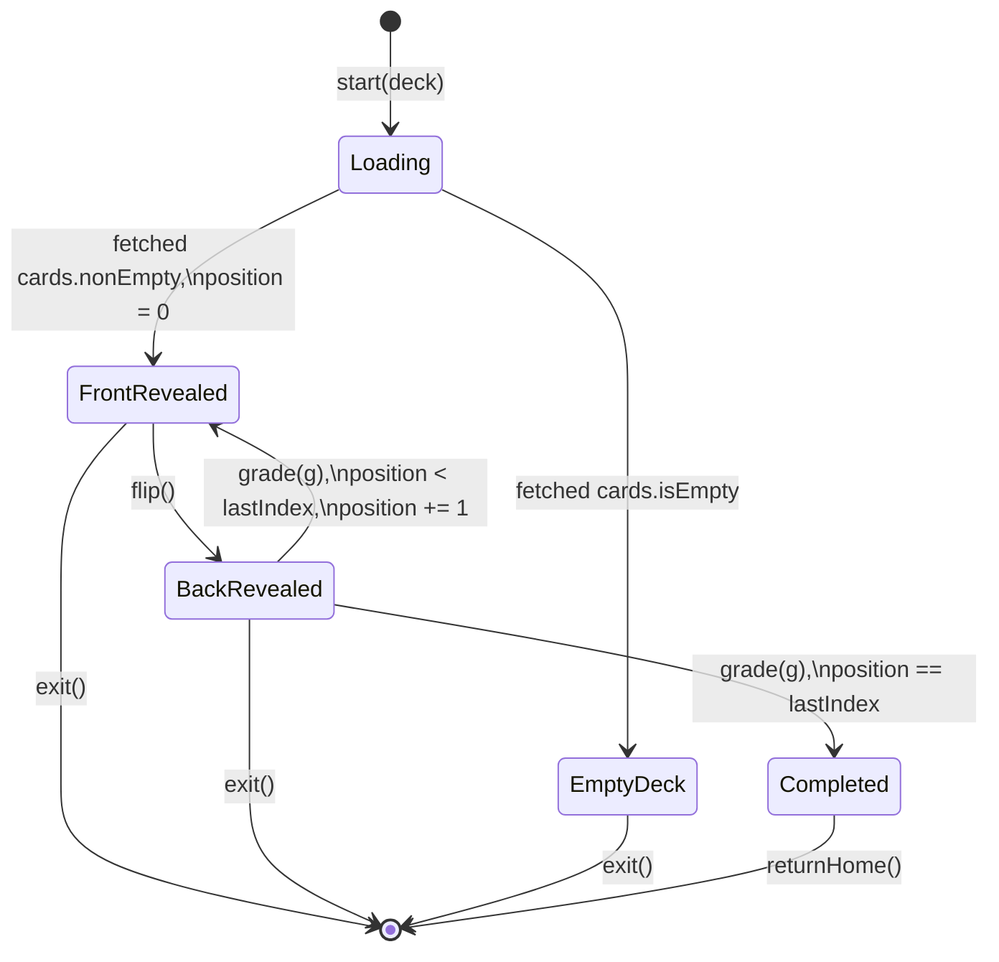

# Design Document — Study Mode (P0)

## Overview

This design describes how HanaHou implements the P0 study-mode feature specified in `.kiro/specs/study-mode/requirements.md`. It covers starting a study session from a Deck, presenting one Card at a time front-first, flipping to reveal the back, self-grading with three confidence-oriented categories (D008), advancing sequentially through the Deck (D009), and a completion surface that returns the user to the home screen (D010).

Scope boundaries (per the requirements introduction):
- In scope: `StudySessionViewModel` (the Study_Manager of Req 9), `StudyView`, `StudyCompletionView`, a `StudySession` value type for the ephemeral session state, a `SelfGrade` enum as the single point of change for the three self-grade categories, and the navigation wiring that adds study as a destination off the per-Deck Card list.
- Out of scope: spaced repetition (P2), shuffle ordering (P1 — the existing `CardOrderingStrategy` protocol is reused so the strategy is swappable), study statistics and history (P1), any `StudyEvent` Core Data entity (P2 — study state is ephemeral in P0), studying from All Cards, mid-session editing, and Apple Pencil interactions during study.

This design deliberately mirrors the card-management design in structure and conventions so the three P0 features compose cleanly. Where a pattern already exists for Decks/Cards, the study-side analogue reuses it. Study mode introduces **no new persistence abstractions**, **no new Core Data entities**, and **no new ordering protocol** — it consumes the existing `CardStore` and `CardOrderingStrategy` as dependencies.

**Self-grade labels resolved.** The Open Question in the requirements (Req 4 AC 1 label set) is resolved to **Option A — "I know it", "I'm close", "No idea"** (confidence-oriented). This design treats the `SelfGrade` enum as the single point of change per D008 and Req 4 AC 6 / Req 9 AC 6 so a future "Test Mode" can swap in outcome-oriented labels without touching views, view models, or tests of unrelated behavior.

Referenced decisions: D003 (many-to-many Card-Deck — study consumes `CardSnapshot.deckIds` read-only), D007 (per-feature TDD), D008 (three self-grade categories, designed to be mutable), D009 (sequential ordering for P0, swappable strategy), D010 (completion returns to home; summary screen is future), D013 (stack navigation), D014/D025/D028 (portrait lock, single point of change), D021 (example-based XCTest only — no PBT), D032 (CardOrderingStrategy is the card-side ordering protocol — reused, not duplicated). Referenced docs: `.kiro/specs/card-management/design.md`, `.kiro/specs/deck-management/design.md`, `docs/p0.md`, `docs/data-model.md`, `.kiro/steering/tech.md`.

## Architecture

Study mode extends the four-layer architecture used by deck-management and card-management. It adds view-model, view, and value-type layers; it does **not** add a persistence layer (no new store, no new entity) and it does **not** add a domain strategy protocol (reuses `CardOrderingStrategy`).

```
┌──────────────────────────────────────────────────────────────┐
│  Views (SwiftUI)                                             │
│  DeckManagementRootView (extended: +.study route)            │
│  StudyView, StudyCompletionView                              │
└──────────────────────────────┬───────────────────────────────┘
                               │ observes @Published state,
                               │ sends intents (flip, grade, exit)
                               ▼
┌──────────────────────────────────────────────────────────────┐
│  View Models (ObservableObject, @MainActor)                  │
│  StudySessionViewModel  ← the "Study_Manager" of Req 9       │
│    wraps a `StudySession` value (the Req 9 state model)      │
└──────────────────────────────┬───────────────────────────────┘
                               │ reads once at session start;
                               │ no writes
                               ▼
┌──────────────────────────────────────────────────────────────┐
│  Domain (reused)                                             │
│  CardOrderingStrategy (reused — D032)                        │
└──────────────────────────────┬───────────────────────────────┘
                               │ reads once at session start
                               ▼
┌──────────────────────────────────────────────────────────────┐
│  Persistence (reused)                                        │
│  CardStore protocol; `fetchInDeck(deckId:)` only             │
│  (CoreDataCardStore prod, InMemoryCardStore tests)           │
└──────────────────────────────────────────────────────────────┘
```

Key conventions carried over:
- **Value types cross boundaries.** Study mode consumes `CardSnapshot`, not `NSManagedObject`. The ephemeral session state is a plain Swift struct (`StudySession`), not a managed object.
- **Protocol dependencies, not concrete types.** `StudySessionViewModel` depends on `CardStore` and `CardOrderingStrategy` — never `CoreDataCardStore` or `CardCreationDateAscendingOrdering`. Tests substitute the in-memory store and stub strategies (Req 9 AC 4, 9 AC 5, 10 AC 1).
- **Pull-at-start, not subscribe.** Unlike the list view models, `StudySessionViewModel` does **not** subscribe to `CardStore.changes`. It reads the Deck's Cards exactly once at session start and treats that ordered list as an immutable snapshot for the duration of the session (Req 1 AC 8). Mutations to the Card store during a session are intentionally ignored.
- **No new Core Data entity.** All session state is in-memory and is discarded on exit or completion (Req 6 AC 6, Req 7 AC 2, Req 9 AC 2).

### Session lifecycle (state-machine view)

A `StudySession` is a state machine with four phases. The Study_Manager's intents (`flip`, `grade`, `exit`, `finish`) drive transitions; the view renders whichever UI surface corresponds to the current phase.



Notes on the state machine:
- `Loading` is an internal, pre-render state (between "user taps Study" and "view model has fetched cards"). In practice the fetch happens synchronously in `init`; the diagram separates it for clarity.
- `flip()` in `BackRevealed` is a no-op (Req 3 AC 5) — no arrow, no state change.
- There is no `BackRevealed -> FrontRevealed` arrow **for the same card** — reveal is monotonic within a card (Req 3 AC 5 and Req 5 AC 4 together imply no backward navigation).
- `grade(g)` always advances: either to the next card's `FrontRevealed` or to `Completed`.

### Where the session lives in the navigation stack

A study session is a navigation destination pushed onto the existing stack, not a modal sheet. This matches D013 (stack navigation) and Req 8 AC 1. The session is scoped to whatever `StudySessionViewModel` instance the `.study(deck)` destination creates; popping back to the Card list discards that view model along with its `StudySession` state.

```
DeckListView
    └── CardListView(deck)
            └── StudyView(deck)              ← new destination
                    └── StudyCompletionView  ← replaces StudyView on completion
```

Popping past `CardListView` after completion (Req 6 AC 5: "return to Deck list root") is done by clearing the navigation path. See §Views.

## Data Models

Study mode introduces **no Core Data schema change**. The v3 schema established by card-management is consumed unchanged. All new types are plain Swift values.

### `SelfGrade` (enum — the single point of change for D008)

```swift
/// The three self-grade categories the user can assign to a Card in study mode.
///
/// Per D008, the set of categories is designed to be mutable — but the enum
/// itself is the single point of change. Views, view models, and tests
/// render labels via `SelfGrade.label`; none hard-codes the display string.
///
/// The P0 labels are confidence-oriented (the user reported what they knew,
/// not what they got right or wrong). A future "Test Mode" can swap in
/// outcome-oriented labels (e.g., "Got it", "Close", "Missed") by changing
/// this one file.
enum SelfGrade: String, Equatable, CaseIterable {
    case know       // "I know it"
    case close      // "I'm close"
    case noIdea     // "No idea"

    var label: String {
        switch self {
        case .know:   return "I know it"
        case .close:  return "I'm close"
        case .noIdea: return "No idea"
        }
    }
}
```

Design notes:
- **Case names are semantic, not display strings.** `.know`/`.close`/`.noIdea` describe the concept. `label` is the display string. Renaming `label` does not break any caller. Renaming a case is a compile-time-checked rename through the whole codebase. This is the "single point of change" shape required by Req 4 AC 6 and Req 9 AC 6.
- **`String` raw value** is present for future-proofing: if P2 persists a `StudyEvent`, the raw value is a stable on-disk identifier independent of the display label. P0 does not persist anything, but choosing a stable raw representation now costs nothing.
- **`CaseIterable`** is required by Req 9 AC 6 so the view can render `SelfGrade.allCases` — no hand-kept parallel list.
- **`Equatable`** is required to assert on `StudySession.grades[cardId] == .close` in tests (Req 10 AC 3.7).
- **Exactly three cases.** Test 10 AC 3.12 pins this by asserting `SelfGrade.allCases.count == 3` and that each `label` is distinct and non-empty.

### `StudySession` (the Req 9 state value type)

```swift
/// Ephemeral, in-memory state of an ongoing study session. Corresponds to
/// the Req 9 "Study_Session" state model. Not persisted.
///
/// A `StudySession` is fully described by these five fields; the phase
/// discriminates which fields the view should read. Holding the state in
/// a plain struct (rather than scattering it across view-model properties)
/// keeps the state machine's invariants local and inspectable in tests
/// (Req 10 AC 1 — tests drive the model with no Core Data and no simulator).
struct StudySession: Equatable {
    let deckId: UUID
    let cards: [CardSnapshot]          // ordered at session start; immutable
    var position: Int                  // 0-based index into `cards`
    var phase: Phase
    var grades: [UUID: SelfGrade]      // cardId -> grade, append-only within a session

    enum Phase: Equatable {
        case frontRevealed              // current card's back is hidden
        case backRevealed               // current card's back is visible, grade buttons live
        case completed                  // every card graded
        case emptyDeck                  // deck had 0 cards at start
    }
}
```

Field-by-field:
- **`deckId`** — echoed from the Deck the session was started from. The session does not fetch anything by `deckId` after `init`; the field is retained so the completion and exit paths can describe the source (e.g., "You finished {deckName}"). If the session ends up never needing to reference the Deck by name beyond the view passing it in, this field can be dropped in a future spec — it is cheap to keep and makes tests self-describing.
- **`cards`** — the ordered snapshot taken at session start (Req 1 AC 8, Req 9 AC 1, Req 9 AC 3). `let`, so the compiler prevents any accidental mid-session mutation. If the source Deck changes during the session, the session does not care.
- **`position`** — zero-based index (Glossary "Card_Position"). Valid range is `0..<cards.count` while `phase` is `.frontRevealed` or `.backRevealed`. Irrelevant in `.emptyDeck` and `.completed`.
- **`phase`** — the single discriminator driving the view (Req 9 AC 1).
- **`grades`** — a dictionary keyed by `CardSnapshot.id` (Req 9 AC 1, Req 10 AC 3.7). An entry is written exactly when the user selects a grade for a card; no entry is ever overwritten (backward navigation is disallowed — Req 5 AC 4). The dictionary exists so that a future P1 summary screen, or an in-session debug view, can see what was graded.

**Invariants enforced by the view model** (documented here, asserted in tests):
1. `phase == .emptyDeck ⟺ cards.isEmpty`.
2. `phase == .completed ⟹ grades.count == cards.count`.
3. `phase ∈ {.frontRevealed, .backRevealed} ⟹ 0 <= position < cards.count`.
4. `grades.keys ⊆ Set(cards.map { $0.id })` — no grade for a card not in the session's snapshot.
5. Once `phase == .completed` it does not transition to any other phase through the model's public API (only `returnHome()` tears the session down entirely).

### `CurrentCardView` (view-model projection)

To keep the view layer thin, `StudySessionViewModel` exposes a small read-only projection that pre-computes what the current card view needs. This is the study-side analogue of `CardRowItem` in card-management.

```swift
struct CurrentCardView: Equatable {
    let frontText: String
    let backText: String              // always present; view chooses whether to show it based on phase
    let position: Int                 // 0-based
    let total: Int                    // cards.count
    let phase: StudySession.Phase
}
```

Computed from `StudySession` on demand; it is not stored. The view reads it via a `@Published` field on the view model.

### No new error types

Study mode does not introduce any new error enum. The only thing that can fail is `CardStore.fetchInDeck(deckId:)` at session start. That failure is surfaced via a `@Published` optional `loadError: Error?` on `StudySessionViewModel` (same pattern as `CardListViewModel.loadError`) and rendered as an alert on `StudyView` with an OK action that pops back to the Card list. There is no new `StudyError` type — inventing one would add surface area without payoff.

## Components and Interfaces

### `StudySessionViewModel` (Req 9's "Study_Manager")

The Study_Manager is a view model — not a separate service layer type. It lives at `HanaHou/ViewModels/StudySessionViewModel.swift`. It owns exactly one `StudySession` value and exposes intent methods that mutate it.

```swift
@MainActor
final class StudySessionViewModel: ObservableObject {

    // MARK: - Published state

    /// Current session state. The view renders `.phase`-dependent surfaces.
    @Published private(set) var session: StudySession

    /// Projection of the current card's display data. `nil` in the
    /// `.emptyDeck` and `.completed` phases.
    @Published private(set) var currentCard: CurrentCardView?

    /// Error from the initial fetch. Surfaced as an alert by `StudyView`.
    @Published var loadError: Error?

    // MARK: - Dependencies (protocols only — Req 9 AC 4, 9 AC 5)

    private let store: CardStore
    private let strategy: CardOrderingStrategy

    // MARK: - Init (fetches + orders at construction time)

    /// Loads cards from the store, applies the ordering strategy, and
    /// establishes the session's initial phase. Synchronous — matches
    /// how `CardListViewModel` fetches in its `init`.
    init(
        deckId: UUID,
        store: CardStore,
        strategy: CardOrderingStrategy
    )

    // MARK: - Intents

    /// Transitions `.frontRevealed` -> `.backRevealed` for the current
    /// card. No-op in every other phase (Req 3 AC 5).
    func flip()

    /// Records the grade for the current card and advances. If the
    /// current card is the last one, transitions to `.completed`
    /// (Req 5 AC 1, 5 AC 2). No-op in `.frontRevealed`, `.emptyDeck`,
    /// or `.completed`.
    func grade(_ grade: SelfGrade)

    /// Discards session state (Req 7 AC 2). The caller (`StudyView`) is
    /// responsible for popping the navigation stack.
    func exit()

    /// Called by `StudyCompletionView` when the user taps
    /// "Return Home". Discards session state (Req 6 AC 6); the caller
    /// clears the navigation path back to the Deck list root.
    func returnHome()
}
```

Responsibilities:
- **Fetch-and-order-at-start.** `init` calls `try store.fetchInDeck(deckId: deckId)` and applies `strategy.order(_:)` to the result (Req 9 AC 3). On success, `session` is built with `position = 0` and `phase = cards.isEmpty ? .emptyDeck : .frontRevealed` (Req 1 AC 6, Req 1 AC 9). On failure, `session` is built in `.emptyDeck` (so the view has *something* to render) and `loadError` is populated so the alert fires.
- **Intent methods are pure state transitions.** None of them touches the store. That is what makes Req 1 AC 8 ("snapshot at start") a compile-time guarantee rather than a runtime promise.
- **`currentCard` is kept in sync with `session`.** Every mutation to `session` re-derives `currentCard`. Implementation detail: a private `refreshCurrentCard()` is called at the end of each intent method.
- **No `reload()` method.** Unlike `CardListViewModel`, the study view model is not pull-based against `CardStore.changes` (Req 1 AC 8). It does not subscribe and does not expose a reload. If the user wants fresh cards, they exit and re-enter.
- **`exit()` and `returnHome()` are distinct intents.** They do the same thing to the model (clear state) but the view layer treats them differently: `exit()` pops one level (back to `CardListView`, Req 7 AC 3), `returnHome()` pops to root (Req 6 AC 5).

### State transitions — explicit table

This table enumerates every (current phase, intent) pair. The view model is expected to pass exhaustive tests that assert this table (Req 10 AC 3.5, 3.6, 3.8, 3.9).

| Current phase | Intent            | Next phase                         | Side effects                                    |
|---------------|-------------------|------------------------------------|-------------------------------------------------|
| `.frontRevealed` | `flip()`          | `.backRevealed`                    | none                                             |
| `.frontRevealed` | `grade(g)`        | `.frontRevealed` (unchanged)       | **no-op** — grading is gated on back reveal      |
| `.frontRevealed` | `exit()`          | session discarded                  | caller pops nav stack one level                  |
| `.frontRevealed` | `returnHome()`    | session discarded                  | caller pops to root                              |
| `.backRevealed`  | `flip()`          | `.backRevealed` (unchanged)        | **no-op** (Req 3 AC 5)                           |
| `.backRevealed`  | `grade(g)` and `position < cards.count - 1` | `.frontRevealed` | `position += 1`, `grades[currentCard.id] = g` (Req 5 AC 1) |
| `.backRevealed`  | `grade(g)` and `position == cards.count - 1` | `.completed`    | `grades[currentCard.id] = g` (Req 5 AC 2)        |
| `.backRevealed`  | `exit()`          | session discarded                  | caller pops one level                            |
| `.backRevealed`  | `returnHome()`    | session discarded                  | caller pops to root                              |
| `.completed`     | `flip()`          | `.completed` (unchanged)           | no-op                                            |
| `.completed`     | `grade(g)`        | `.completed` (unchanged)           | no-op                                            |
| `.completed`     | `returnHome()`    | session discarded                  | caller pops to root (Req 6 AC 5, 6 AC 6)         |
| `.emptyDeck`     | any               | `.emptyDeck` (unchanged) unless `exit()`/`returnHome()` | `exit()` and `returnHome()` discard |

"No-op" means: no change to `session`, no change to `currentCard`, no Published republish. Tests assert both the phase and the absence of a `currentCard` change (using an `XCTKVOExpectation` or a simple `@Published` sink counter).

### `StudyView` (SwiftUI)

`StudyView` is a single SwiftUI view that renders different content based on `viewModel.session.phase`. All three content surfaces live in the same view so the transition between them is just a phase change — no separate navigation push per phase.

```swift
struct StudyView: View {
    let deck: DeckSnapshot
    @StateObject var viewModel: StudySessionViewModel
    let onExit: () -> Void          // pops one level (back to CardListView)
    let onReturnHome: () -> Void    // pops to root (Deck list)

    var body: some View {
        ZStack {
            switch viewModel.session.phase {
            case .frontRevealed, .backRevealed:
                activeSessionContent
            case .completed:
                StudyCompletionView(deckName: deck.name, onReturnHome: {
                    viewModel.returnHome()
                    onReturnHome()
                })
            case .emptyDeck:
                emptyDeckContent
            }
        }
        .navigationTitle(deck.name)
        .toolbar {
            ToolbarItem(placement: .topBarTrailing) {
                if viewModel.session.phase == .frontRevealed
                   || viewModel.session.phase == .backRevealed {
                    Button("Exit") {
                        viewModel.exit()
                        onExit()
                    }
                    .accessibilityIdentifier("StudyExitButton")
                }
            }
        }
        .alert(
            "Couldn't load cards",
            isPresented: Binding(
                get: { viewModel.loadError != nil },
                set: { if !$0 { viewModel.loadError = nil } }
            ),
            presenting: viewModel.loadError
        ) { _ in
            Button("OK", role: .cancel) {
                viewModel.loadError = nil
                onExit()
            }
        } message: { err in
            Text(err.localizedDescription)
        }
    }
}
```

The `activeSessionContent` builder renders:
- The progress label ("3 of 10", Req 2 AC 5) at the top.
- The front text of the current card (always visible per Req 2 AC 1 and Req 3 AC 2).
- The back text **iff** `phase == .backRevealed` (Req 2 AC 2 hides it in `.frontRevealed`; Req 3 AC 2 shows both when `.backRevealed`).
- **In `.frontRevealed`:** a large "Show Back" button (Req 2 AC 4). The three grade buttons are **not** rendered (Req 2 AC 3).
- **In `.backRevealed`:** three grade buttons, one per `SelfGrade` case (Req 3 AC 3, Req 4 AC 1, Req 4 AC 2). The "Show Back" affordance is **not** rendered (Req 3 AC 4). Each button's label comes from `SelfGrade.label`; no hard-coded strings (Req 9 AC 6).

The `emptyDeckContent` builder shows "This deck has no cards to study yet." plus a "Back to deck" button that triggers `onExit()` (Req 1 AC 10).

### `StudyCompletionView` (SwiftUI)

```swift
struct StudyCompletionView: View {
    let deckName: String
    let onReturnHome: () -> Void

    var body: some View {
        VStack(spacing: 16) {
            Text("Finished studying \(deckName).")      // Req 6 AC 2
                .font(.title2)
            Button("Return Home") {                     // Req 6 AC 3
                onReturnHome()
            }
            .buttonStyle(.borderedProminent)
            .accessibilityIdentifier("StudyReturnHomeButton")
        }
        // No statistics, no grade counts (Req 6 AC 4).
    }
}
```

The completion view takes the deck name and a callback; it holds **no** reference to the view model. It is a pure, stateless presentation view, which makes it trivial to smoke-test.

### Navigation integration

`DeckManagementRoute` gains one case:

```swift
enum DeckManagementRoute: Hashable {
    case createDeck
    case editDeck(DeckSnapshot)
    case allCards
    case cardList(DeckSnapshot)
    case createCard(deckId: UUID)
    case editCard(CardSnapshot)
    case study(DeckSnapshot)             // new
}
```

`DeckManagementRootView.destination(for:)` gains the matching case:

```swift
case .study(let deck):
    StudyView(
        deck: deck,
        viewModel: StudySessionViewModel(
            deckId: deck.id,
            store: cardStore,
            strategy: cardStrategy      // P0: CardCreationDateAscendingOrdering
        ),
        onExit:       { path.removeLast() },
        onReturnHome: { path.removeLast(path.count) }
    )
```

`CardListView` gains the entry-point affordance: a toolbar button next to (or replacing) the current "+" trailing toolbar item, calling `onNavigate(.study(deck))` (Req 1 AC 1, Req 8 AC 2).

```swift
// In CardListView's .toolbar
ToolbarItem(placement: .topBarTrailing) {
    Button {
        onNavigate(.study(deck))
    } label: {
        Label("Study", systemImage: "play.fill")
    }
    .accessibilityIdentifier("StudyButton")
    .disabled(viewModel.items.isEmpty)     // match Req 1 AC 9's empty-deck handling at the UI level
}
```

Note on `.disabled(items.isEmpty)`: the requirements explicitly allow starting a session for an empty deck and handle it via `.emptyDeck` (Req 1 AC 9 / Req 1 AC 10). The UI-level disable is therefore optional — I am including it as a usability nicety, but the `StudySessionViewModel` and `StudyView` must remain correct for an empty deck regardless, because the deck can change between the Card list's read and the Study view's read. Tests exercise the empty-deck path at the view-model layer, which is the source of truth.

`AllCardsView` gets **no** study affordance (Req 8 AC 2 — "SHALL NOT be reachable from the All Cards view in P0"). No change to `AllCardsView`.

### Orientation lock

Study mode inherits the existing Info.plist portrait lock (D014, D028). No study-side override exists. Req 8 AC 3 and Req 8 AC 4 are satisfied by **not adding anything** — the single point of change stays where deck-management put it. The test `HanaHouTests/Configuration/InfoPlistOrientationTests.swift` continues to guard this; no new test is needed.

## Requirements Traceability

Every acceptance criterion in the requirements document maps to at least one component (value type, view model, view, or wiring change). The table below is the definitive map; the Testing Strategy section references it to justify each test case.

| Req | AC | Satisfied by |
|-----|----|--------------|
| 1   | 1  | `CardListView` toolbar "Study" button → `onNavigate(.study(deck))` |
| 1   | 2  | `StudySessionViewModel.init` → `store.fetchInDeck(deckId:)` |
| 1   | 3  | `StudySessionViewModel.init` → `strategy.order(_:)` applied to fetched cards, stored in `session.cards` |
| 1   | 4  | Composition root injects `CardCreationDateAscendingOrdering` (existing) |
| 1   | 5  | `StudySessionViewModel.init(strategy:)` takes `CardOrderingStrategy` (protocol) |
| 1   | 6  | `StudySessionViewModel.init` → `session.position = 0`, `phase = .frontRevealed` when cards non-empty |
| 1   | 7  | `StudyView`'s `.frontRevealed` branch renders `currentCard` |
| 1   | 8  | `StudySession.cards` is `let`; view model never calls the store after init |
| 1   | 9  | `StudySessionViewModel.init` → `phase = .emptyDeck` when `cards.isEmpty` |
| 1   | 10 | `StudyView`'s `.emptyDeck` branch — message + "Back to deck" button calling `onExit()` |
| 2   | 1  | `StudyView.activeSessionContent` renders `currentCard.frontText` when `phase == .frontRevealed` |
| 2   | 2  | `.frontRevealed` branch does not render back text |
| 2   | 3  | `.frontRevealed` branch does not render grade buttons |
| 2   | 4  | `.frontRevealed` branch renders "Show Back" button → `viewModel.flip()` |
| 2   | 5  | Progress label rendered from `currentCard.position + 1` and `currentCard.total` |
| 3   | 1  | `StudySessionViewModel.flip()` transitions `.frontRevealed` → `.backRevealed` |
| 3   | 2  | `.backRevealed` branch renders both front and back text |
| 3   | 3  | `.backRevealed` branch renders three buttons, one per `SelfGrade` case |
| 3   | 4  | `.backRevealed` branch does not render "Show Back" |
| 3   | 5  | `StudySessionViewModel.flip()` is a no-op when `phase == .backRevealed` |
| 4   | 1  | `SelfGrade` has exactly three cases; grade buttons use `SelfGrade.allCases` |
| 4   | 2  | `.backRevealed` branch wires each button to `viewModel.grade(_:)` |
| 4   | 3  | `StudySessionViewModel.grade(_:)` writes `session.grades[currentCard.id] = g` |
| 4   | 4  | `StudySessionViewModel.grade(_:)` calls the advance logic |
| 4   | 5  | No `StudyEvent` entity; `grades` is in-memory only |
| 4   | 6  | `SelfGrade` enum + `label` computed property are the single point of change |
| 5   | 1  | `grade(_:)` increments `position` and sets `phase = .frontRevealed` when `position < cards.count - 1` |
| 5   | 2  | `grade(_:)` sets `phase = .completed` when `position == cards.count - 1` |
| 5   | 3  | `position` is monotonically non-decreasing; no public API decrements it |
| 5   | 4  | No `goBack()` intent exists (absence is the contract) |
| 6   | 1  | `StudyView` switches to `StudyCompletionView` when `phase == .completed` |
| 6   | 2  | `StudyCompletionView` displays "Finished studying \(deckName)." |
| 6   | 3  | `StudyCompletionView` renders a single "Return Home" button |
| 6   | 4  | `StudyCompletionView` body contains no statistics |
| 6   | 5  | `onReturnHome` callback does `path.removeLast(path.count)` |
| 6   | 6  | `StudySessionViewModel.returnHome()` discards session state (view model is deallocated when `StudyView` pops) |
| 7   | 1  | `StudyView` toolbar "Exit" button, visible in `.frontRevealed` and `.backRevealed` |
| 7   | 2  | `StudySessionViewModel.exit()` clears session state |
| 7   | 3  | `onExit` callback does `path.removeLast()` (back to Card list) |
| 7   | 4  | No persistence path exists; `grades` is dropped with the view model |
| 8   | 1  | `.study(deck)` is a `navigationDestination` on the existing `NavigationStack` |
| 8   | 2  | Study button exists in `CardListView`, not `AllCardsView` |
| 8   | 3  | Inherits Info.plist portrait lock (D014/D028); no study-side override |
| 8   | 4  | No new orientation config introduced |
| 9   | 1  | `StudySession` struct with `deckId`, `cards`, `position`, `phase`, `grades` |
| 9   | 2  | No new Core Data entity; `.xcdatamodel` unchanged |
| 9   | 3  | `StudySessionViewModel.init` calls `store.fetchInDeck(deckId:)` then `strategy.order(_:)` |
| 9   | 4  | `StudySessionViewModel.init` takes `CardStore` (protocol) |
| 9   | 5  | `StudySessionViewModel.init` takes `CardOrderingStrategy` (protocol) |
| 9   | 6  | `SelfGrade: Equatable, CaseIterable` with single-point `label` property |
| 10  | 1  | All `StudySessionViewModel` tests use `InMemoryCardStore`; no Core Data stack; XCTest only |
| 10  | 2  | `SelfGradeTests` asserts three cases, distinct non-empty labels |
| 10  | 3  | 12 enumerated test cases — see Testing Strategy below |

## Error Handling

| Source | Error | Surfacing |
|--------|-------|-----------|
| `CardStore.fetchInDeck(deckId:)` at session start | `CardStoreError.persistenceFailed(underlying:)` or any thrown `Error` | `StudySessionViewModel.loadError` set; `phase` forced to `.emptyDeck` so the view has a safe render; `StudyView` shows an alert whose OK action calls `onExit()` back to the Card list. |
| User taps "Flip" in `.backRevealed` | — | No-op; no error; no alert (Req 3 AC 5). |
| User taps grade in `.frontRevealed` (shouldn't be reachable via UI, but belt-and-suspenders) | — | No-op. The grade buttons are not rendered in `.frontRevealed`, so this only matters for the view model's intent method. |
| User taps "Exit" mid-session | — | Not an error. Session state discarded; nav pops (Req 7). |

There are no validation errors in study mode — the three user intents are `flip`, `grade(SelfGrade)`, and `exit`, none of which can produce a domain-level validation failure. No alerts are needed for any of them.

No logging is added. If the initial fetch fails, the error is surfaced to the user via the alert and dropped — study mode does not write to `os.Logger`, matching the existing convention of letting the persistence layer own logging.

## Testing Strategy

Per D021 and Req 10 AC 1, testing is **example-based XCTest only**.

**Why PBT is not appropriate here, even though study mode is a state machine.** A `StudySession` is a small finite state machine with at most four phases and a handful of transitions per phase. The input space that matters for correctness is enumerated in the state-transition table above — every cell is a one-shot example. Property-based testing would add framework overhead (HanaHou has no PBT dependency; adding one violates "no third-party dependencies in P0") without surfacing bugs that hand-picked examples miss, because there are no properties of the form "for all inputs X, the state machine does Y" that would be more revealing than case-by-case transitions. D021 already ratified this approach for P0; study mode inherits it.

Framework: XCTest only (tech.md: Apple frameworks, no third-party dependencies in P0).

### Test files and behaviors

| File | Lives in | What it tests |
|------|----------|---------------|
| `HanaHouTests/Domain/SelfGradeTests.swift` | `HanaHouTests/Domain/` | `SelfGrade` enum shape: three cases, labels distinct and non-empty (Req 10 AC 2, Req 10 AC 3.12, Req 9 AC 6). |
| `HanaHouTests/ViewModels/StudySessionViewModelTests.swift` | `HanaHouTests/ViewModels/` | Every `StudySessionViewModel` transition and invariant (Req 10 AC 1, Req 10 AC 3.1 through 3.11). Uses `InMemoryCardStore` + stub strategies. |
| `HanaHouTests/Views/DeckManagementSmokeTests.swift` **(extended)** | `HanaHouTests/Views/` | Wiring-level smoke: `.study(deck)` route resolves to `StudyView`; `CardListView` exposes a "Study" button (identifier check); `StudyCompletionView` renders the deck name and a "Return Home" button. |

Test names follow the existing `test_…` convention.

### The 12 enumerated test cases from Req 10 AC 3

Every one of these lives in `HanaHouTests/ViewModels/StudySessionViewModelTests.swift` except where noted. Each test uses a fresh `InMemoryCardStore` and an explicit `CardOrderingStrategy` (the real `CardCreationDateAscendingOrdering` for order-related tests; a test-local stub strategy where the test needs to assert "the session uses whatever the strategy returned").

**Stub strategy used by several tests:**
```swift
/// Test-only ordering strategy that returns a caller-supplied order
/// regardless of input. Used to prove the view model applies the
/// strategy's output verbatim (Req 9 AC 3, 9 AC 5).
private struct FixedOrderStrategy: CardOrderingStrategy {
    let fixed: [CardSnapshot]
    func order(_ cards: [CardSnapshot]) -> [CardSnapshot] { fixed }
}
```

| # | Requirement | Test name (proposed) | File |
|---|-------------|---------------------|------|
| 1 | Req 10 AC 3.1 — zero-card deck → `.emptyDeck`, no card displayed | `test_init_withEmptyDeck_entersEmptyDeckPhase_andExposesNoCurrentCard` | `StudySessionViewModelTests.swift` |
| 2 | Req 10 AC 3.2 — non-empty deck → `.frontRevealed` at `position = 0` | `test_init_withNonEmptyDeck_entersFrontRevealedAtPositionZero` | `StudySessionViewModelTests.swift` |
| 3 | Req 10 AC 3.3 — session uses strategy's output verbatim | `test_init_appliesOrderingStrategyToFetchedCards` (uses `FixedOrderStrategy`) | `StudySessionViewModelTests.swift` |
| 4 | Req 10 AC 3.4 — P0 strategy matches per-Deck Card list order | `test_init_withP0Strategy_ordersByCreatedAtAscWithIdTiebreaker` | `StudySessionViewModelTests.swift` |
| 5 | Req 10 AC 3.5 — `flip()` in `.frontRevealed` → `.backRevealed` at same position | `test_flip_inFrontRevealed_transitionsToBackRevealed_sameCard` | `StudySessionViewModelTests.swift` |
| 6 | Req 10 AC 3.6 — `flip()` in `.backRevealed` is a no-op | `test_flip_inBackRevealed_isNoOp` | `StudySessionViewModelTests.swift` |
| 7 | Req 10 AC 3.7 — `grade(_:)` records grade against current card's id | `test_grade_recordsGradeForCurrentCardId` | `StudySessionViewModelTests.swift` |
| 8 | Req 10 AC 3.8 — `grade(_:)` at non-last position advances and returns to `.frontRevealed` | `test_grade_notLastPosition_advancesAndReturnsToFrontRevealed` | `StudySessionViewModelTests.swift` |
| 9 | Req 10 AC 3.9 — `grade(_:)` at last position transitions to `.completed` | `test_grade_atLastPosition_transitionsToCompleted` | `StudySessionViewModelTests.swift` |
| 10 | Req 10 AC 3.10 — ordered sequence is a start-time snapshot | `test_orderedSequence_isSnapshotAtStart_notAffectedByStoreMutations` | `StudySessionViewModelTests.swift` |
| 11 | Req 10 AC 3.11 — `exit()` clears state and does not persist grades | `test_exit_discardsInMemoryState_andPersistsNothing` | `StudySessionViewModelTests.swift` |
| 12 | Req 10 AC 3.12 — `SelfGrade` has exactly 3 cases with distinct non-empty labels | `test_selfGrade_hasThreeCasesWithDistinctNonEmptyLabels` | `SelfGradeTests.swift` |

A small number of additional tests follow naturally from the state-transition table above (for example: `test_grade_inFrontRevealed_isNoOp`, `test_returnHome_inCompleted_discardsState`, `test_init_fetchFailure_rendersEmptyDeckPhase_andSetsLoadError`). These are not in the Req 10 AC 3 enumeration but are cheap to write alongside the enumerated ones and keep the transition table fully pinned.

### Smoke tests (view wiring)

Added to `HanaHouTests/Views/DeckManagementSmokeTests.swift`:

- **`test_study_routeResolvesToStudyView`** — building `DeckManagementRootView` and pushing `.study(deck)` resolves a view of the expected type; no runtime assertion failure.
- **`test_cardListView_exposesStudyButton`** — `CardListView`'s accessibility identifier tree contains `StudyButton` when the deck has at least one card.
- **`test_studyCompletionView_rendersDeckNameAndReturnHomeButton`** — static snapshot of `StudyCompletionView(deckName: "Japanese", onReturnHome: {})`: its body contains the deck name substring and the `StudyReturnHomeButton` identifier.

The view-body snapshots follow the same pattern already used in `DeckManagementSmokeTests.swift` for the card-side views.

### Test file headers

Every new test file carries the existing header pattern:

```swift
//
//  <Name>.swift
//  HanaHouTests
//
//  Feature: study-mode
//  Covers requirements: 1.x, 2.y, ...
//  Test cases from Req 10 AC 3: <numbers from the table above>
//
```

## File Layout

All additions live under existing directories — no new top-level folders, no new subdirectories.

```
HanaHou/
├── Models/
│   ├── SelfGrade.swift                  (new)
│   └── StudySession.swift               (new — struct + Phase enum + CurrentCardView)
├── Domain/
│   └── (no changes — reuses CardOrderingStrategy)
├── Persistence/
│   └── (no changes — reuses CardStore)
├── ViewModels/
│   └── StudySessionViewModel.swift      (new)
├── Views/
│   ├── StudyView.swift                  (new)
│   ├── StudyCompletionView.swift        (new)
│   └── DeckManagementRootView.swift     (modified: add .study route + destination, pass strategy through)
├── CardListView.swift                   (modified: add "Study" toolbar button)
└── HanaHou.xcdatamodeld/                (UNCHANGED — Req 9 AC 2)
```

Mirrored test layout under `HanaHouTests/`:

```
HanaHouTests/
├── Domain/
│   └── SelfGradeTests.swift                   (new)
├── ViewModels/
│   └── StudySessionViewModelTests.swift       (new)
└── Views/
    └── DeckManagementSmokeTests.swift         (extended — three smoke cases)
```

### AGENTS.md updates required

Per the HanaHou convention ("update AGENTS.md when files are added, removed, or repurposed"), these files need touch-ups when this design ships:

- `HanaHou/Models/AGENTS.md` — add entries for `SelfGrade.swift` and `StudySession.swift`.
- `HanaHou/ViewModels/AGENTS.md` — add entry for `StudySessionViewModel.swift`.
- `HanaHou/Views/AGENTS.md` — add entries for `StudyView.swift` and `StudyCompletionView.swift`; note the `CardListView` and `DeckManagementRootView` modifications.
- `HanaHouTests/Domain/AGENTS.md` — add entry for `SelfGradeTests.swift`.
- `HanaHouTests/ViewModels/AGENTS.md` — add entry for `StudySessionViewModelTests.swift`.
- `HanaHouTests/Views/AGENTS.md` — note the extended smoke tests.

No change to `HanaHou/Domain/AGENTS.md`, `HanaHou/Persistence/AGENTS.md`, or their test counterparts — those directories are unchanged.

## Composition Root Changes

`HanaHou/HanaHouApp.swift` needs **no change** — `DeckManagementRootView` already receives `cardStore` and `cardStrategy`, and `StudySessionViewModel` is constructed on demand inside the `.study(deck)` navigation destination from the same two dependencies. Adding study mode is purely additive to `DeckManagementRootView` (one new `DeckManagementRoute` case and one new `destination(for:)` arm).

`HanaHou/Persistence.swift` also needs **no change** — study mode does not introduce a new store or a new factory.

## Open Design Decisions

Decisions intentionally deferred to implementation or to a future spec:

1. **Exit confirmation dialog.** The requirements do not mandate one (Req 7 AC 1 says "exits the Study_Session without completing it"). This design ships without a confirmation; if usage reveals that users tap Exit accidentally, a dialog is an additive UI-layer change that does not touch the view model.
2. **Progress indicator format.** "3 of 10" per Req 2 AC 5 is the stated example; exact copy/styling is an implementation-time choice.
3. **Flip animation.** Not mandated by the requirements. The P0 implementation can use any SwiftUI transition (or none); the view-model state machine does not observe animation.
4. **Empty-deck "Back to deck" copy.** Placeholder string in this design; finalize during implementation.

## Decisions to Record in `docs/decisions.md`

This design surfaces the following decisions that should be ratified and added to `docs/decisions.md` after the design is approved. **This document does not edit `docs/decisions.md` directly** — the user ratifies and records them.

1. **Self-grade labels resolved to Option A ("I know it" / "I'm close" / "No idea").** Confidence-oriented framing was chosen over outcome-oriented framing for P0 study mode. A future "Test Mode" can swap in outcome-oriented labels via the `SelfGrade.label` property — the enum remains the single point of change per D008.
2. **`StudySessionViewModel` depends on protocols, not concrete types.** The view model takes `CardStore` and `CardOrderingStrategy` protocols, never `CoreDataCardStore` or a concrete strategy. This is the testability seam that lets `StudySessionViewModelTests` run against `InMemoryCardStore` with no Core Data stack.
3. **Session ordering uses a snapshot taken at session start; mid-session mutations to the source Deck are ignored.** The `StudySession.cards` array is `let`; `StudySessionViewModel` does not subscribe to `CardStore.changes`. This is the structural guarantee behind Req 1 AC 8.
4. **`StudyEvent` persistence is deferred to P2.** P0 study sessions are entirely in-memory; no Core Data entity is added. Grades are discarded on exit or completion. When P2 introduces `StudyEvent`, it will be additive: the view model can optionally write to a new `StudyEventStore` without touching the state machine.
5. **`SelfGrade` gets a `String` raw value even though P0 does not persist it.** The stable on-disk identifier is separate from the display label, so P2 persistence and future label changes can happen independently.
6. **Study mode is reachable from the per-Deck Card list only, not from All Cards (P0).** Matches Req 8 AC 2. Starting a study session for "all cards regardless of deck" is a P1+ feature that would need a new `CardStore` query (e.g., `fetchAll()` + some scope concept) and a different UX entry point.
